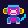

<a name="readme-top"></a>

[![Contributors][contributors-shield]][contributors-url]
[![Forks][forks-shield]][forks-url]
[![Stargazers][stars-shield]][stars-url]
[![Issues][issues-shield]][issues-url]
[![MIT License][license-shield]][license-url]

<!-- PROJECT LOGO -->
<br />
<div align="center">
  <a href="https://drive.google.com/file/d/1L4_uvuf5mVFcC37eR3Vud-JPbPkb9u4K/view?usp=drive_link">
    
  </a>

  <h3 align="center">ApeZords Doginal Theory</h3>

  <p align="center">
    Follow this read me to start inscribing directly on-chain on the Dogecoin Blockchain using a Linux Ubunutu 22.04!
    <br />
    <a href="https://x.com/booktoshi"><strong>~by Booktoshi</strong></a>
    <br />
    <br />
    <a href="https://x.com/thenoderunners">Node Runners</a>
    ·
    <a href="https://discord.gg/z7DBSZnuWE">The Node Runner Repo/VC Discord</a>
    ·
    <a href="https://github.com/apezord">ApeZord</a>
  </p>
</div>

<!-- DOGINALS -->

[![Product Name Screen Shot][product-screenshot]](https://x.com/apezord)

The history of Doginals on the Dogecoin blockchain is an interesting journey that began in 2023. The concept of Doginals, also known as DRC-20 tokens, was introduced to add a fresh dimension to Dogecoin. It allowed for the inscription of unique data on Dogecoin units known as Shibs, effectively creating collectible digital assets. These assets are similar to NFTs but are integrated directly into Dogecoin's blockchain, leveraging its security and ease of use.

The idea of Doginals was initiated and deployed by a pseudonymous individual known as Anon (twitter: @apezord) back in February 2023. This marked the beginning of a new era for Dogecoin, as it allowed users to engage with the blockchain in a more creative and interactive manner while also recording the assets directly on-chain.

The process of creating, trading, and owning Doginals is supported by a vibrant community and various tools designed for this purpose. The Bitcoin Ordinals, Crypto NFTs, developers, and Doginal Communities are among the key resources for users interested in Doginals.

In 2023, the first collection of 10,000 Inscriptions was registered on the Dogecoin blockchain, marking a significant milestone in the adoption of Doginals. This was followed by the creation of the DRC-20 standard, which further facilitated the creation and trading of these digital assets.

The introduction of Doginals has brought a new layer of utility and functionality to Dogecoin, allowing it to move beyond its original use case as a fun cryptocurrency. It has opened up new avenues for innovation and creativity in the blockchain space, with a growing community of enthusiasts and developers contributing to its growth.

In summary, the history of Doginals on the Dogecoin blockchain is a testament to the power of community and innovation. It has transformed Dogecoin from a meme-based cryptocurrency into a platform for the creation and trading of unique digital assets.

The Node Runners carry on the tradition and provenance that ApeZord has set-forth through his Doginal Theory on Dogecoin Blockchain.

<p align="right">(<a href="#readme-top">back to top</a>)</p>


<!-- GETTING STARTED -->
## Getting Started on Ubuntu 22.04 VPS/Linux System 

This is an example of how you may give instructions on setting up your project locally.
To get a local copy up and running follow these simple example steps.

### Prerequisites

The programs and dependencies below are needed to run most Doginal protocols found within this repository.

You must have downloaded and installed a Dogecoin Node and have set up your dogecoin.conf file properly before performing the steps below. You can follow this link in order to learn <a href="https://bit.ly/dogecoinnode"><strong>how to install and operate a Dogecoin Node on a Ubunutu 22.04 using a VPS/Linux System.</strong></a>

1. Install Node.js through NVM Copy the curl command below to audit the download of Node.js
  ```
  curl -o- https://raw.githubusercontent.com/nvm-sh/nvm/v0.39.1/install.sh
  ```
2. Copy the curl command below to download Node.js
  ```sh
  curl -o- https://raw.githubusercontent.com/nvm-sh/nvm/v0.39.1/install.sh | bash
  ```
3. The source command below will install node.js to your system
  ```sh
  source ~/.bashrc
  ```
4. Now run the install stable command below to install the most recent stable version of node.js
  ```sh
  nvm install stable
  ```
5. Lastly, install NPM via command below
  ```sh
  sudo apt install npm
  ```

### ApeZords Doginal.js Installation

_Now we will download the Doginal repository to our system and install the ApeZord Doginal Inscriber._

1. First clone the repo into your system
  ```sh
  git clone https://github.com/booktoshi/doginals.git
  ```
2. Go into doginals folder
  ```sh
  cd doginals
  ```
3. Create and save your .env environment file.
   ```sh
   nano .env
   ```
4. Save the file settings.
   ```sh
   ctrl + x ~~> Press Y ~~> ENTER
   ```
5. Copy and paste the below .env format.
   ```
   NODE_RPC_URL=http://127.0.0.1:22555
   NODE_RPC_USER=<username>
   NODE_RPC_PASS=<password>
   TESTNET=false
   FEE_PER_KB=30000000
   ```
6. Save the file settings.
   ```sh
   ctrl + x ~~> Press Y ~~> ENTER
   ```
7. Create a new wallet from the terminal.
   ```sh
   node . wallet new
   ```
8. Retrieve your private key from your wallet file. DO NOT CHANGE ANY 
   INFORMATION. YOU ARE ONLY COPYING YOUR PRIVATE KEY AND WALLET ADDRESS.
   ```sh
   nano .wallet.json
   ```
9. In your terminal run the following command to import your private 
   key into your Dogecoin Node
   ```sh
   dogecoin-cli importprivkey <your_private_key> <optional_label> false
   ```
10. Send $DOGE to your new Doginal Inscription wallet from another   
    wallet, your CEX or by swapping another crypto into $DOGE https://t.me/WEN_SWAP_BOT
11. Once your $DOGE is sent, give it about 5 minutes for your UTXO's 
    to settle. You can check this by importing your Inscription wallet into DogeLabs Chrome Extension, going to doge.ordinalswallet.com, connecting your wallet on the wallet view page, and making sure that your "Incoming" UTXO's are no longer orange and you have a full balance.
12. To check your Doginal Inscription Wallet Balance and to also Sync 
    your wallet to the Dogecoin Blockchain, run the command below.
   ```sh
   node . wallet sync
   ```
### Minting Files & Pictures/Videos

13. From file:
   ```sh
   node . mint <address> <path>
   ```
   Example:
   ```sh
   node . mint D9Ue4zayx5NP7sTSBMM9uwuzqpHv4HnkaN dog.jpeg
   ```
14. From data:
   ```sh
   node . mint <address> <content type> <base64>
   ```
   Example:
   ```sh
   node . mint D9Ue4zayx5NP7sTSBMM9uwuzqpHv4HnkaN "text/plain;charset=utf-8" 576f6f6621
   ```
15. Deploy DRC-20
   ```sh
   node . drc-20 deploy <address> <ticker> <max token supply> <max allowed mint limit>
   ```
   Example:
   ```sh
   node . drc-20 deploy D9Ue4zayx5NP7sTSBMM9uwuzqpHv4HnkaN depl 21000000 100
   ```
16. Minting DRC-20
   ```sh
   node . drc-20 mint <address> <ticker> <amount>
   ```
   Example:
   ```sh
   node . drc-20 mint D9Ue4zayx5NP7sTSBMM9uwuzqpHv4HnkaN dogi 1000
   ```
17. Optional: Viewing, Start the server:
   ```sh
   node . server
   ```
18. And open your browser to:
   ```sh
   http://localhost:3000/tx/15f3b73df7e5c072becb1d84191843ba080734805addfccb650929719080f62e
   ```

<p align="right">(<a href="#readme-top">back to top</a>)</p>


<!-- USAGE EXAMPLES -->
## Doginal Theory Protocol

The doginals protocol allows any size data to be inscribed onto subwoofers.

An inscription is defined as a series of push datas:
    ```sh
    "ord"
    OP_1
    "text/plain;charset=utf-8"
    OP_0
    "Woof!"
    ```
For doginals, we introduce a couple extensions. First, content may spread across multiple parts:
    ```
    "ord"
    OP_2
    "text/plain;charset=utf-8"
    OP_1
    "Woof and "
    OP_0
    "woof woof!"
    ```

This content here would be concatenated as "Woof and woof woof!". This allows up to ~1500 bytes of data per transaction.

Second, P2SH is used to encode inscriptions.

There are no restrictions on what P2SH scripts may do as long as the redeem scripts start with inscription push datas.

And third, inscriptions are allowed to chain across transactions:

Transaction 1:
    ```sh
    "ord"
    OP_2
    "text/plain;charset=utf-8"
    OP_1
    "Woof and "
    ```

Transaction 2
    ```sh
    OP_0
    "woof woof!"
    ```

With the restriction that each inscription part after the first must start with a number separator, and number separators must count down to 0.

This allows indexers to know how much data remains.
_For more examples, please refer to the [Documentation](https://example.com)_

<p align="right">(<a href="#readme-top">back to top</a>)</p>


<!-- ROADMAP -->
## FAQ

### I'm getting ECONNREFUSED errors when minting

There's a problem with the node connection. Your dogecoin.conf file should look something like:    
    
    rpcuser=ape
    rpcpassword=zord
    rpcport=22555
    server=1
    

Make sure "port" is not set to the same number as "rpcport". Also make sure "rpcauth" is not set.

Your .env file should look like:
  
   ```sh
   NODE_RPC_URL=http://127.0.0.1:22555
   NODE_RPC_USER=<username>
   NODE_RPC_PASS=<password>
   TESTNET=false
   FEE_PER_KB=30000000
   ```

### I'm getting "insufficient priority" errors when minting

The miner fee is too low. You can increase it up by putting FEE_PER_KB=30000000 in your .env file or just wait it out. The default is 210000000 but spikes up when demand is high.

<p align="right">(<a href="#readme-top">back to top</a>)</p>

<!-- INCLUDED PROGRAMS -->
## Included Node Runner Programs & Scripts

The programs listed below are stable programs and scripts included within this repository created and designed by The Node Runners. The programs and scripts included within this repository will be regularly updated as the new programs and scripts are tested and proven to work. There will be guides coming soon for each and every tool made.

- APE DUNES GUI
- APE Image Converter
- BC Auto Scripts
- BC Snapshot
- BCxHeim Recurse
- BP MetaData Merger
- BP TelegramBot
- SirDuney DUNES

<!-- CONTRIBUTING -->
## Contributing

Contributions are what make the open source community such an amazing place to learn, inspire, and create. Any contributions you make are **greatly appreciated**.

If you have a suggestion that would make this better, please fork the repo and create a pull request. You can also simply open an issue with the tag "enhancement".
Don't forget to give the project a star! Thanks again!

1. Fork the Project
2. Create your Own Branch (`git checkout -b feature/AmazingFeature`)
3. Commit your Changes (`git commit -m 'Add some AmazingFeature'`)
4. Push to the Branch (`git push origin feature/AmazingFeature`)
5. Open a Pull Request

<p align="right">(<a href="#readme-top">back to top</a>)</p>


<!-- LICENSE -->
## License

Distributed under the MIT License. See `LICENSE.txt` for more information.

<p align="right">(<a href="#readme-top">back to top</a>)</p>


<!-- CONTACT -->
## Contact

Your Name - [@booktoshi](https://x.com/booktoshi) - xahnobi@gmail.com 

<p align="right">(<a href="#readme-top">back to top</a>)</p>


<!-- ACKNOWLEDGMENTS -->
## Acknowledgments

***If You would like to support with Donations, Send all Dogecoin tothe following Contributors:***

1. Booktoshi - X: <a href="https://x.com/booktoshi"><strong>@booktoshi</strong></a> - Wallet: D9Ue4zayx5NP7sTSBMM9uwuzqpHv4HnkaN

2. ApeZord - X: <a href="https://x.com/apezord"><strong>@apezord</strong></a> - Wallet: DNmrp12LfsVwy2Q2B5bvpQ1HU7zCAczYob

3. BillyBitcoins - X: <a href="https://x.com/billybitcoins"><strong>@BillyBitcoins</strong></a> - Wallet: DQAWs4LQKY3zVmorsLHDUCV7LE5ox6rho6

4. Big Chief - X: <a href="https://x.com/martinseeger2"><strong>@MartinSeeger2</strong></a> - Wallet: DCHxodkzaKCLjmnG4LP8uH6NKynmntmCNz

5. Great Ape - X: <a href="https://x.com/Greatape42069E"><strong>@Greatape42069E</strong></a> - Wallet:  DBpLvNcR1Zj8B6dKJp4n3XEAT4FmRxbnJb

6. ZachWei - X: <a href="https://x.com/ZachZwei"><strong>@ZachZwei</strong></a> - Wallet: DU3rJD4gAXEZkhnhp95idUfGssPD3bXBZa

7. Heimdall - X: <a href="https://x.com/Heimdall_Bull"><strong>@Heimdall_Bull</strong></a> - Wallet: DEpFirPqu8DZUoCT7zEzGZs74JPTCF3ZMJ

8. Danny - X: <a href="https://x.com/Dogepay_DRC20"><strong>@Dogepay_DRC20</strong></a> - Wallet: 

<p align="right">(<a href="#readme-top">back to top</a>)</p>


<!-- MARKDOWN LINKS & IMAGES -->
<!-- https://www.markdownguide.org/basic-syntax/#reference-style-links -->
[contributors-shield]: https://img.shields.io/github/contributors/booktoshi/doginals.svg?style=for-the-badge
[contributors-url]: https://github.com/booktoshi/doginals/graphs/contributors
[forks-shield]: https://img.shields.io/github/forks/booktoshi/doginals.svg?style=for-the-badge
[forks-url]: https://github.com/booktoshi/doginals/forks
[stars-shield]: https://img.shields.io/github/stars/booktoshi/doginals.svg?style=for-the-badge
[stars-url]: https://github.com/booktoshi/doginals/stargazers
[issues-shield]: https://img.shields.io/github/issues/booktoshi/doginals.svg?style=for-the-badge
[issues-url]: https://github.com/booktoshi/doginals/issues
[license-shield]: https://img.shields.io/github/license/booktoshi/doginals.svg?style=for-the-badge
[license-url]: https://github.com/booktoshi/doginals/blob/master/LICENSE.txt
[product-screenshot]: images/logo.png
[Next.js]: https://img.shields.io/badge/next.js-000000?style=for-the-badge&logo=nextdotjs&logoColor=white
[Next-url]: https://nextjs.org/
[React.js]: https://img.shields.io/badge/React-20232A?style=for-the-badge&logo=react&logoColor=61DAFB
[React-url]: https://reactjs.org/
[Vue.js]: https://img.shields.io/badge/Vue.js-35495E?style=for-the-badge&logo=vuedotjs&logoColor=4FC08D
[Vue-url]: https://vuejs.org/
[Angular.io]: https://img.shields.io/badge/Angular-DD0031?style=for-the-badge&logo=angular&logoColor=white
[Angular-url]: https://angular.io/
[Svelte.dev]: https://img.shields.io/badge/Svelte-4A4A55?style=for-the-badge&logo=svelte&logoColor=FF3E00
[Svelte-url]: https://svelte.dev/
[Laravel.com]: https://img.shields.io/badge/Laravel-FF2D20?style=for-the-badge&logo=laravel&logoColor=white
[Laravel-url]: https://laravel.com
[Bootstrap.com]: https://img.shields.io/badge/Bootstrap-563D7C?style=for-the-badge&logo=bootstrap&logoColor=white
[Bootstrap-url]: https://getbootstrap.com
[JQuery.com]: https://img.shields.io/badge/jQuery-0769AD?style=for-the-badge&logo=jquery&logoColor=white
[JQuery-url]: https://jquery.com 
